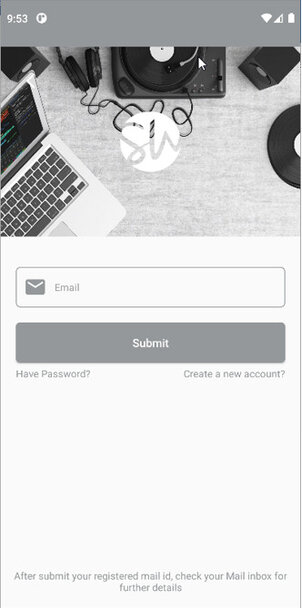

# Attention
If you have an error 'SDK location not found', follow this link to solve the error: https://stackoverflow.com/a/48155800

# Screenshots

# Features
* Navigation menu to Home, New Song, Albums, Artist, Personal Music Fragment.
* Search Songs and Albums.
* Player view and mini player view of song.
